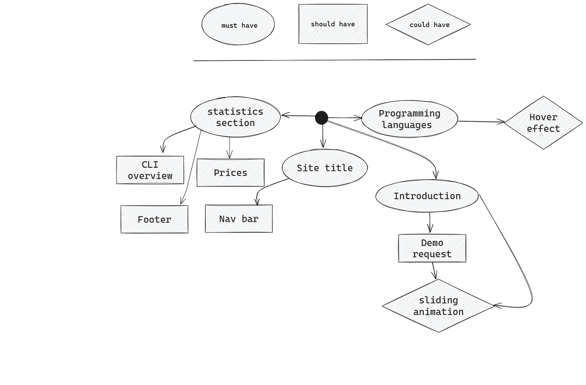

# Backlog

## Must Haves

> these are necessary for basic usability

- **Home Page**
  - As a user I can read the title of the page
    - [ ] There is a prominent title at the top of the webpage: "Loruki."
  - As a user I can read an introduction to this project
    - [ ] There is a section directly under the navbar describing the platform’s
          purpose and benefits
  - As a user, I can view key statistics of the platform
    - [ ] There is a statistics section displaying deployment numbers, published
          data size, and projects hosted.
  - As a software engineer, I can see the supported programming languages
    - [ ] There is a section displaying different programming languages with
          their logos.

## Should Haves

> will complete the user experience, but are not necessary

- **Home Page**
  - As a user I can navigate the web page from a navbar
    - [ ] There is a navbar at the top of the page with links to the different
          sections
  - As a user I can contact us to learn more about our project
    - [ ] There is a footer with contact info
  - As a user, I can request a demo
    - [ ] There is a form with fields for Name, Company Name, and Email, along
          with a "Send" button.
  - As a junior developer, I can see an overview of the CLI tool
    - [ ] There is a section showcasing the CLI with an image and feature
          descriptions.
  - As a non-technical, I can see the estimated prices for different user plans
    - [ ] There is a section below the CLI tool shows the different prices for
          each plan Eco and Basic, Production, Advanced, Enterprise

## Could Haves

> would be really cool ... if there's time

- **Home Page**
  - As a user, I can see a sliding animation in the hero home page area
    - [ ] The page has smooth transition, the introduction should slide to the
          right, the form slides to the left and the statistics section slides
          upward.
  - As a user, I can experience smooth hover effects.
    - [ ] The page has smooth hover effects, on each supported programming
          language.

## Story Sequencing

